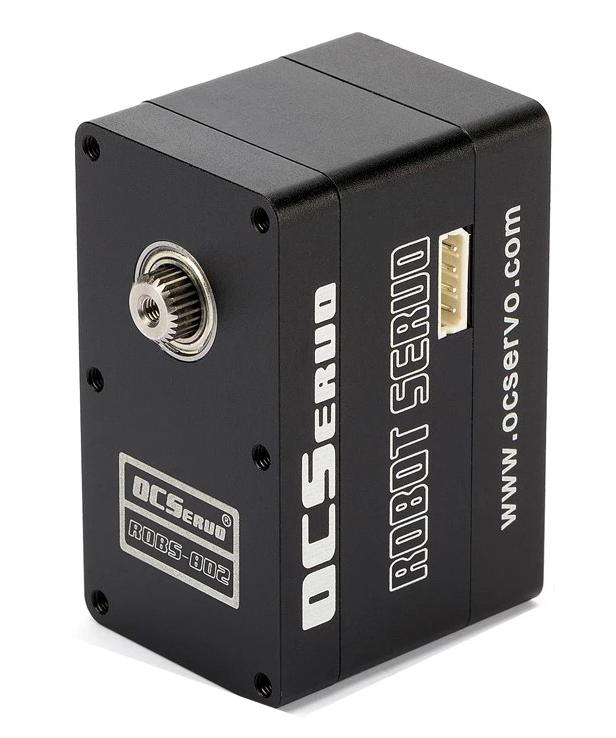
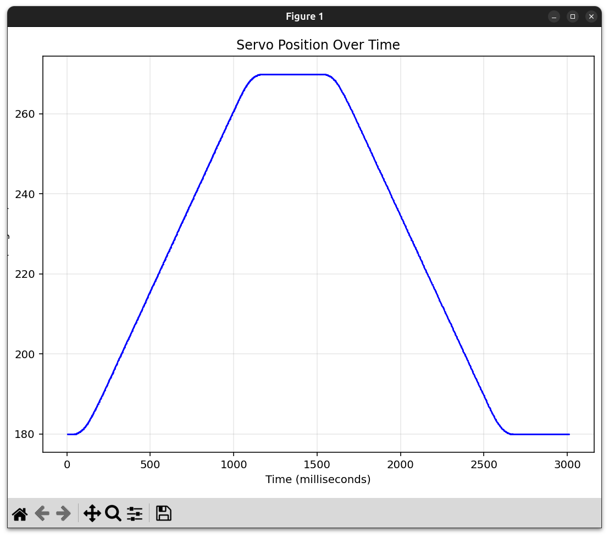

# OCServo RS-485 Servo Protocol - Python Implementation

Python implementation of the OCServo protocol for [ROBS-802](http://en.ocservo.com/qfy-content/uploads/2023/05/19484fd3b2e25b669ed153659d89c40c.pdf) servo and similar. See [OCServo's Robot Servos product line](https://en.ocservo.com/?page_id=15418&qfyuuid=-1&q_term=44&q_type=products).

## ROBS-802 High Torque Robot Servo

### The Integration Advantage
Instead of dealing with separate motors, encoders, drivers, and communication interfaces, the ROBS-802 integrates everything into a single 41.3×34.1×56.5mm package. This isn't just about convenience - it fundamentally changes the system architecture:

- **Single RS-485 bus** handles up to 254 axes (vs. individual step/dir signals)
- **Built-in absolute encoder** eliminates homing sequences and lost steps
- **Integrated driver** means no external motor controllers or tuning
- **90 kgf·cm torque** rivals NEMA 23 steppers but with closed-loop control

If you're building test automation systems, antenna positioners, or any multi-axis motion control setup, the ROBS-802 presents an interesting alternative to traditional stepper or servo solutions. Here's what makes it worth evaluating this project:

- Support for all basic OCServo operations:
  - PING - Test servo connection
  - Read temperature
  - Read/set position
- Live angle-position tracking during servo movement
- Matplotlib visualization support



### Key Technical Merits

1. **Distributed Intelligence**: Each servo handles its own PID control loop, trajectory generation, and protection logic. Your controller just sends position commands - no real-time requirements.

2. **Observable System State**: Unlike steppers that operate open-loop, you can query position, temperature, current, and voltage during operation. This enables adaptive control and predictive maintenance.

3. **Modbus Protocol**: While proprietary "OCS" branded, it's essentially Modbus RTU with custom function codes. Well-understood, easy to implement, with existing debugging tools.

4. **Mechanical Robustness**: CNC aluminum housing and metal gears are genuinely overbuilt for a servo in this price range. The dual ball bearings and 0.25° resolution are respectable specs.

### Bottom Line

At ~$80-100 per unit, the ROBS-802 occupies an interesting niche between hobby servos and industrial solutions. For applications that need many axes of moderate precision motion with minimal wiring complexity, it's a compelling option. The ability to poll real-time status during motion enables closed-loop control strategies that aren't possible with traditional RC servos or open-loop steppers.

Whether you're building an antenna measurement system, automated test fixture, or multi-axis positioning system, the ROBS-802's combination of integration, intelligence, and RS-485 connectivity makes it worth prototyping - especially if you value development time over squeezing out the last bit of performance.

## Installation

1. Install required dependencies:
```bash
pip install -r requirements.txt
```

2. Connect your ROBS-802 servo via RS485 adapter

## Usage

### Example Scripts

#### 1. Motion Test (`test-motion.py`)

Tests servo movement and logs position data with plotting of all angle data collected (~400 angle readings per second):

```bash
./test-motion.py
```


**Features:**
- Moves servo through predefined angles (180° → 270° → 180° → 90° → 180°)
- Continuously logs position during movements
- Displays real-time plot of servo position over time
- No threading conflicts - uses integrated logging during sleep periods

#### 2. Ping Test (`test-ping.py`)

High-speed connectivity and latency testing tool:

```bash
# Default: ping as fast as possible
./test-ping.py

# With 10ms delay between pings
./test-ping.py --delay 10

# Custom port and servo ID
./test-ping.py --port /dev/ttyUSB1 --id 2

# Different baudrate
./test-ping.py --baudrate 115200
```

**Features:**
- Continuously pings servo to test connection stability
- Displays real-time statistics (packets/sec, loss %, RTT)
- Measures round-trip time (min/avg/max)
- Graceful Ctrl+C handling with summary statistics
- Command-line configurable parameters

**Command-line options:**
- `--port`, `-p`: Serial port (default: /dev/ttyUSB0)
- `--baudrate`, `-b`: Baud rate (default: 1000000)
- `--id`, `-i`: Servo ID (default: 1)
- `--delay`, `-d`: Delay between pings in milliseconds (default: 0)

#### 3. Motor Mode Test (`test-motor-mode.py`)

Demonstrates continuous rotation motor mode and automatic mode switching:

```bash
./test-motor-mode.py
```

**Features:**
- Tests switching between servo mode (position control) and motor mode (continuous rotation)
- Demonstrates torque-based speed control (0-100% torque)
- Controls rotation direction (CW/CCW)
- Automatic mode switching when calling servo/motor functions
- Position logging during motor operation with matplotlib visualization

**Motor Mode Example:**
```python
# Switch to motor mode and rotate clockwise at 50% torque
servo.motor_speed(50, cw=True)

# Rotate counter-clockwise at 30% torque
servo.motor_speed(30, cw=False)

# Stop motor
servo.motor_speed(0)

# Automatically switches back to servo mode when setting angle
servo.set_angle(180, time_ms=1000)
```

#### 4. Acceleration Test (`test-acceleration.py`)

Demonstrates PID gain tuning effects on servo acceleration and deceleration:

```bash
./test-acceleration.py
```

**Features:**
- Tests different P gain values (1, 3, 6, 9, 12, 15) to show their effect on motion
- Records position data during step response (90° → 270° instant command)
- Plots all response curves on a single chart for comparison
- Shows how P gain affects:
  - Acceleration rate
  - Overshoot
  - Settling time
  - Steady-state error

**Example output:**
- Lower P gains (1-3): Slow, gentle acceleration
- Medium P gains (6-9): Balanced speed and stability
- Higher P gains (12-15): Fast acceleration

Make sure to update the `SERIAL_PORT` variable in the scripts to match your system:
- Linux: `/dev/ttyUSB0` or `/dev/ttyACM0`
- Windows: `COM3`, `COM4`, etc.
- macOS: `/dev/tty.usbserial-XXXX`

## API Reference

### Basic Example

```python
from OCServo import OCServo

# Create servo instance
servo = OCServo(port='/dev/ttyUSB0', servo_id=1)

# Test connection
if servo.ping():
    print("Servo connected!")

# SERVO MODE - Position Control
# Move to 180 degrees
servo.set_angle(180, time_ms=1000)  # 1 second movement

# Read current position
angle = servo.read_position()
print(f"Current angle: {angle}°")

# MOTOR MODE - Continuous Rotation
# Rotate clockwise at 75% torque
servo.motor_speed(75, cw=True)

# Rotate counter-clockwise at 50% torque
servo.motor_speed(50, cw=False)

# Stop motor
servo.motor_speed(0)

# Read temperature
temp = servo.read_temperature()
print(f"Temperature: {temp}°C")
```

### OCServo Class

#### Constructor
```python
OCServo(port, baudrate=1000000, servo_id=1)
```
- `port`: Serial port path
- `baudrate`: Communication speed (default: 1000000)
- `servo_id`: Servo ID (default: 1)

#### Methods

**Communication:**
- `ping()`: Test servo connection, returns True if servo responds
- `debug(enabled)`: Enable/disable debug mode for packet hexdump

**Reading Values:**
- `read_temperature()`: Read servo temperature in Celsius
- `read_position(raw_angle=False)`: Read current position
  - Returns angle in degrees (0-360°) by default
  - Returns raw position (0-4095) if `raw_angle=True`

**Movement Control:**

*Servo Mode (Position Control):*
- `set_angle(angle, time_ms=0)`: Set servo angle (0-360°)
  - `angle`: Target angle in degrees
  - `time_ms`: Time to reach position in milliseconds (0 = max speed)
  - Automatically switches from motor mode to servo mode if needed
- `set_speed(speed)`: Set servo speed (0-1023)
  - 0 = stopped
  - 1-1023 = speed levels (1023 is maximum speed)
- `set_gain(p_gain)`: Set proportional (P) gain for PID control
  - `p_gain`: Proportional gain value (clipped to 1-15 range)
  - Also sets I and D gains to 0
  - Affects acceleration, deceleration, and position tracking behavior
  - Returns True if successful

*Motor Mode (Continuous Rotation):*
- `motor_speed(torque_percent, cw=True)`: Set motor speed and direction
  - `torque_percent`: Torque as percentage (0-100)
  - `cw`: True for clockwise, False for counter-clockwise
  - Automatically switches from servo mode to motor mode if needed
  - Use `motor_speed(0)` to stop the motor

**Utility Functions:**
- `position_to_angle(position)`: Convert raw position (0-4095) to angle (0-360°)
- `angle_to_position(angle)`: Convert angle (0-360°) to raw position (0-4095)
- `get_baudrate()`: Get the actual baudrate of the serial port
- `is_connected()`: Check if serial port is open and connected
- `reconnect()`: Attempt to reconnect to the serial port

## Technical Notes

### Mode Switching
- The servo has two operating modes: **Servo Mode** (position control) and **Motor Mode** (continuous rotation)
- Mode switching is automatic when using `set_angle()` or `motor_speed()` functions
- The library tracks the current mode internally to minimize unnecessary mode changes
- When switching from motor mode to servo mode, the servo will move to the specified angle
- When switching from servo mode to motor mode, the servo will start rotating continuously

### Protocol Details
- Default baud rate is 1M (1000000)
- Position range: 0-4095 (corresponds to 0-360°)
- Time parameter in `set_angle()`: 0 = maximum speed
- Motor mode torque: 0-100% (internally mapped to 0-1000)
- Make sure your RS485 adapter supports the required baud rate

## Troubleshooting

1. **No response from servo**: 
   - Check serial port path
   - Verify baud rate matches servo configuration
   - Ensure proper RS485 connections

2. **Permission denied on Linux**:
   ```bash
   sudo chmod 666 /dev/ttyUSB0
   # or add user to dialout group
   sudo usermod -a -G dialout $USER
   ```

3. **Slow response**: 
   - Reduce baud rate if using long cables
   - Check for electrical interference

## License

This project is licensed under the Apache License 2.0. See the LICENSE file for details.

Copyright 2025 Milosch Meriac <milosch@meriac.com>